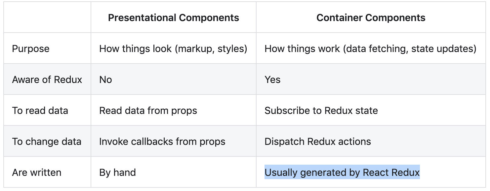

# 與React使用

我們必須強調Redux與React沒有關係。你可以在React、Angular、Ember、jQuery或vanilla應用程始中使用Redux。

但可以說，Redux與React以及Deku有著良好的協調，他們讓你以state函式描述UI，Redux發起state更新以作為對action的回應。

我們可以透過React建立todo應用程式，並整合使用Redux。

> 筆記：[官方文件](https://react-redux.js.org)，了解如何整合使用React與Redux。

## 安裝React Redux

Redux預設不包含React。如下安裝：

```shell
npm install react-redux
```

若你尚未使用npm管理工具，你需要另外下載UMD檔。若你透過`<script>`標籤引用UMD檔案，預設回傳`window.ReactRedux`。

## 陳述式與容器元件

React透過容器元件(container component)與Redux分割陳述元件綁定。這使你的App易於理解並容易複用。以下是容器元件與陳述式元件的差異：



我們會以陳述式元件為主，但仍會產生一些容器元件以與Redux的store連結。以下的設計不意味著容器元件必須要位於元件樹的頂端。如果容器元件變得太複雜(產生複雜巢狀，充滿陳述元件以及回調函式)，請如[筆記](https://redux.js.org/faq/react-redux/#should-i-only-connect-my-top-component-or-can-i-connect-multiple-components-in-my-tree)在元件樹加入其他的容器元件。

技術上說，你需要藉由`store.subscribe()`手寫容器元件。我們不推薦那麼做，因為React Redux的效能優化使得他難以手寫。因此，我們會透過React Redux的`connect()`產生容器元件。

## 設計元件階層

記得我們如何設計根state物件嗎？是時候設計符合他的UI架構。這不單是Redux特有的工作，以React的角度思考是很好的流程訓練。

我們的設計很簡單。顯示待辦清單。點擊項目表示完成該項目，一個提供新增代辦事項的部分，底部則是選擇顯示全部/完成/進行中的篩選器。

## 設計陳述式元件

以下是陳述式元件的簡單描述:

- `TodoList`用以顯示可見事項
  - `todos`：以代辦事項物件組成的陣列`{id,text,completed}`
  - `onTodoClick(id: number)`是當代辦事項點擊時的回調函式。
- `Todo`是單一代辦事項物件
  - `text`：字串
  - `completed`：布林值，代表是否顯示叉叉
  - `onClick()`：當代辦事項點擊時的回調函式。
- `Link`是具有回調函式的連結
  - `onClick()`：當link點擊時的回調函式。
- `Footer`：用戶切換顯示的代辦事項
- `App`：根元件，渲染所有事物

他們描述該如何顯示，但不知道資料來自何處，或如何改變。他們只渲染接收到的資料。如果你不再使用Redux，所有的元件都能維持原樣，他們並不相依於Redux。

## 設計容器元件

我們需要將陳述元件與Redux連結。例如：陳述式元件`ToolList`需要`VisibleList`容器元件訂閱Redux的store並知道如何應用當前顯示篩選器。為了因應顯示篩選改變，我們提供`FilterLink`容器元件渲染調用適合action的連結：

- `VisibleTodoList`依照現在的篩選條件篩選出符合條件的代辦事項並渲染`TodoList`
- `FilterLink`取得當前篩選條件並渲染連結
  - `filter`：代表篩選條件的字串

## 設計其他元件

有時候不容易判斷使用陳述式或容器元件。例如，有些表單與函式綁在一起，如下：

- `AddTodo`是一個有“Add”按鈕的input

技術上我們應該將它拆分開來，但現在為時尚早。在很簡當的狀況下可以將陳述式元件與邏輯混合，當他增場時，如何分割它將會便的明顯。

## 實作元件

開始幹吧！從陳述是元件開始，還不需要與Redux綁定。

### 實作陳述式元件

這全都是普通的React元件，我們不會仔細對待他們。我們撰寫無狀態函式元件(functional stateless component)除非我們需要使用local state或生命週期函式。這不意味著陳述式元件必須是函式，這麼做為時尚早。當你需要使用local state或生命週期函式，或是效能優化，你可以用class撰寫他們。

### components/Todo.js
```js
import React from 'react'
import PropTypes from 'prop-types'
const Todo = ({ onClick, completed, text }) => (
  <li
    onClick={onClick}
    style={{
      textDecoration: completed ? 'line-through' : 'none'
    }}
  >
    {text}
  </li>
)
Todo.propTypes = {
  onClick: PropTypes.func.isRequired,
  completed: PropTypes.bool.isRequired,
  text: PropTypes.string.isRequired
}
export default Todo
```

### components/TodoList.js
```js
import React from 'react'
import PropTypes from 'prop-types'
import Todo from './Todo'
const TodoList = ({ todos, onTodoClick }) => (
  <ul>
    {todos.map((todo, index) => (
      <Todo key={index} {...todo} onClick={() => onTodoClick(index)} />
    ))}
  </ul>
)
TodoList.propTypes = {
  todos: PropTypes.arrayOf(
    PropTypes.shape({
      id: PropTypes.number.isRequired,
      completed: PropTypes.bool.isRequired,
      text: PropTypes.string.isRequired
    }).isRequired
  ).isRequired,
  onTodoClick: PropTypes.func.isRequired
}
export default TodoList
```

### components/Link.js

```js
import React from 'react'
import PropTypes from 'prop-types'
const Link = ({ active, children, onClick }) => {
  if (active) {
    return <span>{children}</span>
  }
  return (
    <a
      href=""
      onClick={e => {
        e.preventDefault()
        onClick()
      }}
    >
      {children}
    </a>
  )
}
Link.propTypes = {
  active: PropTypes.bool.isRequired,
  children: PropTypes.node.isRequired,
  onClick: PropTypes.func.isRequired
}
export default Link
```

### components/Footer.js

```js
import React from 'react'
import FilterLink from '../containers/FilterLink'
import { VisibilityFilters } from '../actions'
const Footer = () => (
  <p>
    Show: <FilterLink filter={VisibilityFilters.SHOW_ALL}>All</FilterLink>
    {', '}
    <FilterLink filter={VisibilityFilters.SHOW_ACTIVE}>Active</FilterLink>
    {', '}
    <FilterLink filter={VisibilityFilters.SHOW_COMPLETED}>Completed</FilterLink>
  </p>
)
export default Footer
```

### 實作容器元件

現在透過容器元件將陳述式元件與Redux連接。技術上而言，容器元件只是React元件使用`store.subscribe()`取得Redux部分state樹並以`props`提供給她所渲染的陳述式元件。你可以手動撰寫容器元件，但我們建議你透過React Redux的`connect()`的函式，他提供許多避免重複渲染的優勢。

為了使用`connect()`，你需要定義一個稱為`mapStateToProps`函式，他描述你如何將Redux當前store state以props傳遞給需要變化的陳述式元件。例如`VisibleTodoList`需要計算該傳遞給`todos`的代辦事項，所以我們定義一個基於`state.vivibilityFilter`篩選`state.todos`的函式，並在`mapStateToProps`使用：

```js
const getVisibleTodos = (todos, filter) => {
  switch (filter) {
    case 'SHOW_COMPLETED':
      return todos.filter(t => t.completed)
    case 'SHOW_ACTIVE':
      return todos.filter(t => !t.completed)
    case 'SHOW_ALL':
    default:
      return todos
  }
}
const mapStateToProps = state => {
  return {
    todos: getVisibleTodos(state.todos, state.visibilityFilter)
  }
}
```

除了讀取state，容器元件可以發起action。基於同一風格，你可以定義`mapDispatchToProps()`函式，接收`dispatch()`方法並回傳你想注入到陳述函式的回調方法。例如，你想要透過`VisibleTodoList`將`onTodoClick()`函式注入到`todoList`元件
，並且透過`onTodoClick`函式發起`TOGGLE_TODO` action：
```js
const mapDispatchToProps = dispatch => {
  return {
    onTodoClick: id => {
      dispatch(toggleTodo(id))
    }
  }
}
```

最後，我們透過`connect()`建立`VivibleTodoList`元件並傳遞這兩個函式：

```js
import { connect } from 'react-redux'
const VisibleTodoList = connect(
  mapStateToProps,
  mapDispatchToProps
)(TodoList)
export default VisibleTodoList
```

這些是React Redux的基本API，還有許多便捷強大的功能，我們建議你深入閱讀文件。

下面是其他的容器元件：


### containers/FilterLink.js

```js
import { connect } from 'react-redux'
import { setVisibilityFilter } from '../actions'
import Link from '../components/Link'
const mapStateToProps = (state, ownProps) => {
  return {
    active: ownProps.filter === state.visibilityFilter
  }
}
const mapDispatchToProps = (dispatch, ownProps) => {
  return {
    onClick: () => {
      dispatch(setVisibilityFilter(ownProps.filter))
    }
  }
}
const FilterLink = connect(
  mapStateToProps,
  mapDispatchToProps
)(Link)
export default FilterLink
```

### containers/VisibleTodoList.js

```js
import { connect } from 'react-redux'
import { toggleTodo } from '../actions'
import TodoList from '../components/TodoList'
const getVisibleTodos = (todos, filter) => {
  switch (filter) {
    case 'SHOW_ALL':
      return todos
    case 'SHOW_COMPLETED':
      return todos.filter(t => t.completed)
    case 'SHOW_ACTIVE':
      return todos.filter(t => !t.completed)
  }
}
const mapStateToProps = state => {
  return {
    todos: getVisibleTodos(state.todos, state.visibilityFilter)
  }
}
const mapDispatchToProps = dispatch => {
  return {
    onTodoClick: id => {
      dispatch(toggleTodo(id))
    }
  }
}
const VisibleTodoList = connect(
  mapStateToProps,
  mapDispatchToProps
)(TodoList)
export default VisibleTodoList
```

### 實作其他元件

### containers/AddTodo.js

如前所述，AddTodo是混合邏輯的陳述式元件。

```js
import React from 'react'
import { connect } from 'react-redux'
import { addTodo } from '../actions'
let AddTodo = ({ dispatch }) => {
  let input
  return (
    <div>
      <form
        onSubmit={e => {
          e.preventDefault()
          if (!input.value.trim()) {
            return
          }
          dispatch(addTodo(input.value))
          input.value = ''
        }}
      >
        <input
          ref={node => {
            input = node
          }}
        />
        <button type="submit">Add Todo</button>
      </form>
    </div>
  )
}
AddTodo = connect()(AddTodo)
export default AddTodo
```

如果你對ref屬性不熟悉，起閱讀[文件](https://reactjs.org/docs/refs-and-the-dom.html)。

### 將元件與容器綁定

### components/App.js

```js
import React from 'react'
import Footer from './Footer'
import AddTodo from '../containers/AddTodo'
import VisibleTodoList from '../containers/VisibleTodoList'
const App = () => (
  <div>
    <AddTodo />
    <VisibleTodoList />
    <Footer />
  </div>
)
export default App
```

## 傳遞Store

容器元件需要存取Redux的store。你可以透過props傳遞，但有點混亂，因為你必須纏繞store與陳述式元件，僅因為他渲染了元件樹的其中一個容器。

我們推薦你使用React Redux的特殊元件`<Provider>`，它使store可以被所有容器元件任意存取，並且不需要傳遞。你只需要在渲染根元件時使用它：

### index.js
```js
import React from 'react'
import { render } from 'react-dom'
import { Provider } from 'react-redux'
import { createStore } from 'redux'
import todoApp from './reducers'
import App from './components/App'
const store = createStore(todoApp)
render(
  <Provider store={store}>
    <App />
  </Provider>,
  document.getElementById('root')
)
```
#Next Steps
Read the complete source code for this tutorial to better internalize the knowledge you have gained. Then, head straight to the advanced tutorial to learn how to handle network requests and routing!

You should also take some time to read through the React-Redux docs to get a better understanding of how to use React and Redux together.