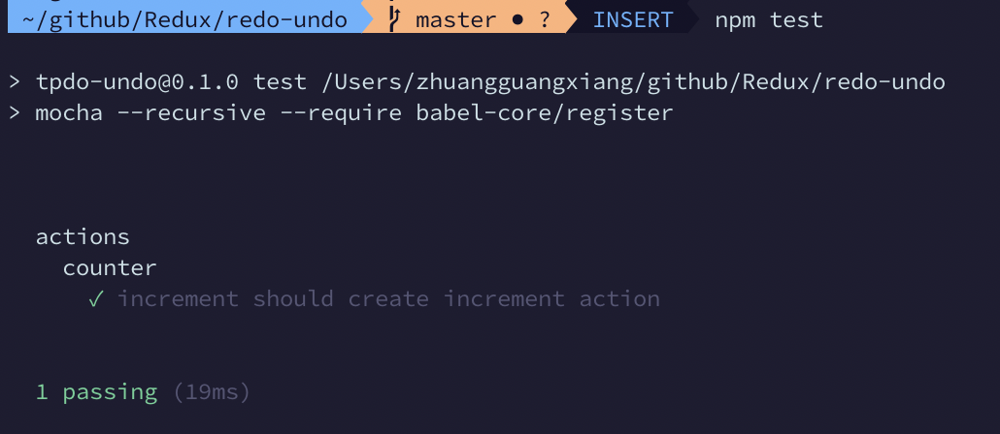

## 撰寫測試
1. 常用函式庫
   1. `Mocha`:
      js的測試框架,透過`describe`(描述),`it`(假設)與`assert`(斷言)產生測試結果
   2. `Enzyme`:
      模擬對`Dom`的操作
   3. `Expect`:
      透過函式庫判斷執行結果
2. 測試reducer
   1. 安裝Mocha(可全域安裝)
    ```shell
    npm install -g Mocha
    ```
   2. 撰寫`package.json`中的測試指令,由於測試檔案中包含較新語法(import),需要再測試時調用`babel-core`的編譯功能,因此需要安裝`babel-core`
      - 安裝babel-core
      ```shell
      npm install babel-core
      ```
      - 測試指令
      ```json
      {
        "scripts": {
            "test": "mocha --recursive --require babel-core/register"
        }
      }
      ```
   3. `babel-croe`編譯時需要`.babelrc`檔指定js版本,加入`.babelrc`
    ```json
    {
        "presets": ["es2015"]
    }
    ```
   4. 由於使用了`es2015`,需透過npm加入專案中
    ```shell
    npm install babel-preset-es2015
    ```
   5. 撰寫測試js
    ```js
    import expect from 'expect';
    import * as Actions from '../../src/actions/actions';

    describe('actions',()=>{
        describe('counter',()=>{
            it('increment should create increment action',()=>{
                expect(Actions.increment()).toEqual({type:Actions.INCREMENT_COUNTER});
            });
        });
    });
    ```
   6. 透過npm執行測試
      - Mocha預設執行test下所有.js的檔案
      - 因我們在`package.json`內設定為`mocha --recursive`,故會執行test下所有資料夾內的.js檔
    ```shell
    npm test
    ```
   7. 執行結果
      